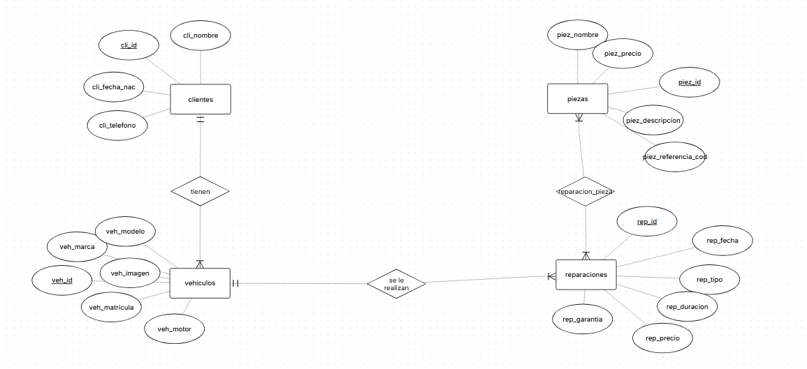
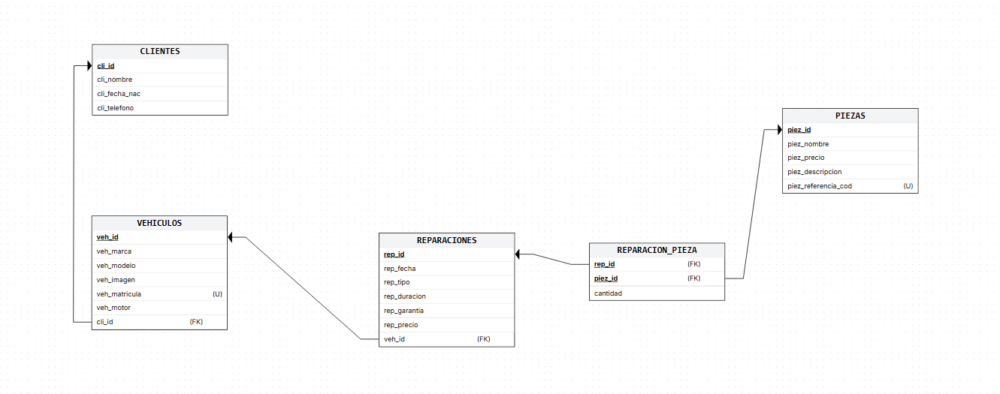
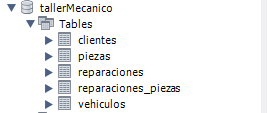
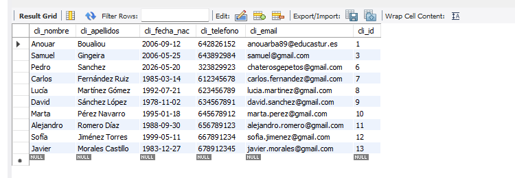

# Proyecto Taller Mecánico


## Descripción

Aplicación web SPA desarrollada con Node.js, Express y JavaScript Vanilla para la gestión de clientes, vehículos y reparaciones de un taller mecánico.

La aplicación permite:

- Gestión de clientes
- Gestión de vehículos
- Gestión de reparaciones
- Gestión de logs e incidencias
- Relación entre clientes y vehículos
- CRUD completo
- Persistencia en MySQL y MongoDB


## Tecnologías utilizadas

- Node.js
- Express
- JavaScript Vanilla
- Bootstrap 5
- MySQL
- MongoDB
- Vercel

## Modelo entidad-relacion




## Vista del diseño de las tablas




## Captura de las tablas y datos en tabla





## Modelo documentos MongoDB

```json
{
  "_id": {
    "$oid": "6a0e1bc2aefd25d8169f3075"
  },
  "vehiculo_id": 2,
  "descripcion": "Cambio de aceite en una semana",
  "prioridad": "Media",
  "estado": "Abierto",
  "fecha": {
    "$date": "2026-05-20T20:38:26.099Z"
  },
  "__v": 0
}
```


## Rutas frontend

| Ruta | Funcionalidad |

| /Dashboard |
| /clientes | Gestión clientes |
| /clientes/:id | Detalle cliente |
| /vehiculos | Gestión vehículos |
| /vehiculos/nuevo | Crear vehículo |
| /vehiculos/editar/:id | Editar vehículo |
| /reparaciones | Gestión reparaciones |

## API REST

| Método | Ruta | Funcionalidad |

| GET | /api/clientes | Obtener clientes |
| POST | /api/clientes | Crear cliente |
| PUT | /api/clientes/:id | Editar cliente |
| DELETE | /api/clientes/:id | Eliminar cliente |

## Aplicación desplegada en Vercel

https://proyecto-taller-mecanico.vercel.app/


## Comentarios

El proyecto está desarrollado siguiendo arquitectura SPA utilizando JavaScript Vanilla y Express como backend REST.

MySQL se utiliza para almacenar entidades relacionales como clientes, vehículos y reparaciones.

MongoDB se utiliza para almacenar logs e incidencias debido a la flexibilidad del modelo documental.